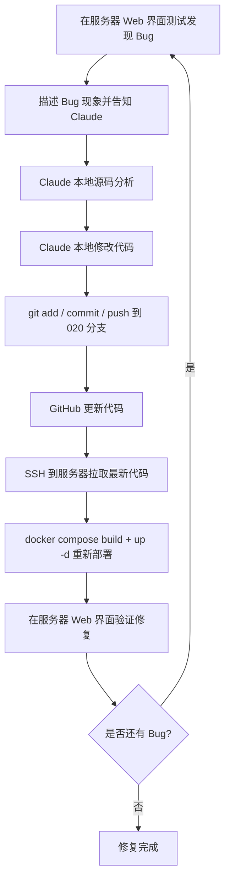

# AI 内容安全模块 Bug 修复方案

## 1. 环境概述

### 1.1 开发环境
- **本地代码仓库**：`C:\Users\iolie\Documents\c-api\c-api`
- **GitHub 仓库**：https://github.com/Channing-xiao/c-api
- **当前开发分支**：`020-ai-content-security`
- **部署分支**：`020-ai-content-security`

### 1.2 测试服务器
- **服务器地址**：`45.251.106.61`
- **Web 访问地址**：http://45.251.106.61:3000
- **登录账号**：`admin`
- **登录密码**：`%XSui9i81fm1!ZC8`
- **部署方式**：Docker Compose（`docker-compose.yml` + `docker-compose.override.yml`）
- **项目路径**：`/home/ai/c-api`

### 1.3 当前已配置工具
- **Claude Code 用户级 skills**：`~/.claude/skills/` 已安装 speckit 系列 skills
- **Claude Code 用户级模板**：`~/.claude/speckit-template/.specify/` 用于新项目初始化
- **Playwright MCP**：`~/.claude/settings.json` 已启用，支持浏览器自动化测试
- **项目级 `.specify/`**：`C:\Users\iolie\Documents\c-api\c-api\.specify/` 已配置

---

## 2. Bug 修复迭代流程



### 2.1 标准操作命令

#### 本地提交
```powershell
cd C:\Users\iolie\Documents\c-api\c-api
git add .
git commit -m "fix(security): 修复 xxx bug"
git push origin 020-ai-content-security
```

#### 服务器更新脚本
```bash
ssh ai@45.251.106.61 "cd /home/ai/c-api && git pull origin 020-ai-content-security && docker compose down && docker compose up -d --build && docker compose ps"
```

#### 服务器快速查看日志
```bash
ssh ai@45.251.106.61 "cd /home/ai/c-api && docker compose logs -f new-api --tail=50"
```

---

## 3. Bug 列表与修复方案

### Bug 1：Mask 动作未将关键字转换为 `***`

#### 现象
在 http://45.251.106.61:3000/security/rules 中创建/编辑规则时，选择 **Action = Mask**，但实际检测时敏感关键字没有被替换为 `***` 符号，脱敏功能未生效。

#### 影响范围
- 后端：`service/security/detector.go`
- 中间件：`middleware/security.go`
- 前端：`web/default/src/features/security/pages/rule-page.tsx` 及表单组件

#### 根因分析
当前 `detector.go` 中 `maskText` 函数实现为：
```go
func maskText(text string) string {
    if len(text) <= 2 {
        return strings.Repeat("*", len(text))
    }
    return text[:1] + strings.Repeat("*", len(text)-2) + text[len(text)-1:]
}
```
该实现只保留首尾字符，中间替换为 `*`，例如 `password` → `p******d`，不符合用户期望的完整隐藏为 `***`。

另外，`middleware/security.go` 中 Mask 动作只替换了请求体/响应体中的完整内容字符串，如果 `ProcessedContent` 为空或替换失败，也会导致 mask 不生效。

#### 修复方案
1. **修改 `maskText` 函数**：将命中的关键字完整替换为固定长度 `***`，而不是保留首尾。
   ```go
   func maskText(text string) string {
       return "***"
   }
   ```
2. **检查 `applyMasking` 的 Position 计算**：确保中文/多字节字符的位置计算正确（当前已使用 rune 转 byte，基本正确）。
3. **检查中间件替换逻辑**：在 `SecurityCheck` 和 `SecurityCheckResponse` 中，确认 `result.ProcessedContent` 不为空时才替换，且替换逻辑能正确作用于请求/响应 JSON。
4. **前端规则测试弹窗**：确保规则测试界面显示 `ProcessedContent` 字段，让用户能看到 mask 后的结果。

#### 验证步骤
1. 在 Web 端创建一条 Keyword 规则，Action 选择 Mask，关键词为 `测试`。
2. 调用聊天接口发送包含 `测试` 的内容。
3. 验证返回内容中 `测试` 被替换为 `***`。
4. 查看安全日志，确认 `processed_content` 字段包含 `***`。

---

### Bug 2：表单填写显示数字而非文字

#### 现象
在 `/security` 的下联页面（规则、策略、分组等表单）中，Select/Dropdown 等表单组件显示的是 `0/1/2/3/4/5` 等数字值，而不是人类可读的标签文字（如 "关键词匹配"/"正则匹配"/"拦截"/"脱敏"等），不方便人工阅读和填写。

#### 影响范围
- 前端表单组件：
  - `web/default/src/features/security/components/rule-form-modal.tsx`
  - `web/default/src/features/security/components/policy-form-modal.tsx`
  - `web/default/src/features/security/components/group-form-modal.tsx`
  - 可能还涉及 `web/default/src/features/security/pages/rule-page.tsx` 的筛选器
- 常量定义：`constant/security.go`（后端）
- i18n：`web/default/src/i18n/locales/en.json` / `zh.json`

#### 根因分析
当前表单可能直接使用了枚举的整数值作为 Select 的 value 和显示文本，没有对 value 做 label 映射。例如：
```tsx
<SelectItem value="1">1</SelectItem>
```
而不是：
```tsx
<SelectItem value="1">{t('Keyword Match')}</SelectItem>
```

#### 修复方案
1. **定义映射常量**：在前端创建安全模块枚举到标签的映射，例如：
   ```typescript
   const ruleTypeOptions = [
     { value: 1, label: t('Keyword Match') },
     { value: 2, label: t('Regex Match') },
     { value: 3, label: t('NER') },
     { value: 4, label: t('AI Detection') },
   ]
   
   const actionOptions = [
     { value: 1, label: t('Pass') },
     { value: 2, label: t('Alert') },
     { value: 3, label: t('Mask') },
     { value: 4, label: t('Block') },
     { value: 5, label: t('Review') },
   ]
   ```
2. **修改表单组件**：将所有使用数字显示的地方替换为 label 显示，value 仍保持数字。
3. **补充 i18n 键值**：在 `en.json` 和 `zh.json` 中添加对应的标签翻译。
4. **列表页显示**：规则列表/策略列表中的 Action、Type、Scope、Status 等列也显示文字标签而不是数字。

#### 验证步骤
1. 打开 `/security/rules` 页面，点击新建规则。
2. 检查 Type、Action、Status 等下拉框是否显示中文/英文标签。
3. 保存后查看列表页，确认显示的是标签文字而非数字。
4. 同样验证 `/security/policies` 和 `/security/groups` 表单。

---

### Bug 3：关键字 Block 后，未匹配内容仍被 Block

#### 现象
当某条 Keyword 规则设置为 Block 并命中一次后，后续发送不包含该关键字的内容，仍然会被拦截并提示 "请求包含敏感内容，已被拦截"。

#### 影响范围
- 后端检测引擎：`service/security/engine_keyword.go`
- 检测主逻辑：`service/security/detector.go`
- 缓存逻辑：`service/security/cache.go`
- 中间件：`middleware/security.go`

#### 根因分析
可能原因：
1. **缓存污染**：`securityRuleCache` 或 `securityPolicyCache` 是进程内全局 map，如果某次检测后将错误规则存入缓存，后续请求会使用错误规则。
2. **匹配逻辑错误**：`KeywordDetector.Detect` 中使用了 `matchedRules[rule.ID] = true` 来避免重复匹配同一条规则，但如果 `allKeywords` 为空时返回的结果被错误地标记为 Detected，会导致误报。
3. **AC 自动机匹配问题**：`MultiPatternSearch` 返回的 `hit.Word` 是 `[]rune`，转换为 string 后用于 keywordRuleMap 查找，大小写处理可能不一致。
4. **全局状态**：`regexCache` 是全局缓存，但只缓存编译后的正则，不会导致误报。
5. **中间件状态**：`bufferedResponseWriter` 每次请求都会新建，不会有状态残留。

最可疑的是：**缓存中可能存入了错误状态，或者 detector 的单例状态被污染**。

#### 修复方案
1. **检查缓存失效时机**：确保规则/策略的增删改都会调用 `InvalidateRuleCache()` / `InvalidatePolicyCache()`。
2. **在 detector 中增加防御性检查**：
   - 如果 `allMatches` 为空，强制设置 `result.Detected = false`。
   - 如果 `result.Action` 为 Block 但没有任何 match，降级为 Pass。
3. **KeywordDetector 增加空匹配保护**：如果 `hits` 为空或所有匹配都是空字符串，返回 `Detected = false`。
4. **添加日志**：在 `Detect` 函数中记录每次检测的规则数量、命中数量、最终动作，便于排查。
5. **单元测试**：添加测试用例验证：
   - 第一次请求含敏感词被 block
   - 第二次请求不含敏感词正常通过

#### 验证步骤
1. 创建一条 Keyword 规则，关键词为 `敏感词`，Action = Block。
2. 第一次发送包含 `敏感词` 的内容，确认被 block。
3. 第二次发送不包含 `敏感词` 的内容，确认正常返回。
4. 第三次再次发送包含 `敏感词` 的内容，确认仍然被 block。
5. 查看服务器日志，确认每次检测的命中情况。

---

## 4. 修复优先级

| 优先级 | Bug | 原因 |
|--------|-----|------|
| P1 | Bug 2 表单数字显示 | 影响所有用户操作，最直观 |
| P2 | Bug 1 Mask 未生效 | 影响核心安全功能 |
| P3 | Bug 3 误报 Block | 影响正常使用，需要详细日志排查 |

---

## 5. 自动化测试建议

### 5.1 本地单元测试
- `service/security/detector_test.go` 增加 mask、block、无命中场景测试
- `service/security/engine_keyword_test.go` 增加连续两次检测场景

### 5.2 服务器端到端测试
使用 Playwright MCP 或 curl 脚本：
```bash
# 1. 登录获取 token
# 2. 调用 /api/security/rules 创建规则
# 3. 调用 /v1/chat/completions 测试 block/mask/pass
# 4. 验证响应内容
```

### 5.3 快速验证命令
```bash
# 测试 mask
curl -X POST http://45.251.106.61:3000/v1/chat/completions \
  -H "Authorization: Bearer $TOKEN" \
  -H "Content-Type: application/json" \
  -d '{"model":"gpt-3.5-turbo","messages":[{"role":"user","content":"这是一个测试"}]}'
```

---

## 6. 回滚策略

如果修复导致更严重问题，可以快速回滚到上一个稳定版本：

```bash
# 本地回滚到上一个提交
git reset --hard HEAD~1
git push origin 020-ai-content-security --force

# 服务器重新部署
ssh ai@45.251.106.61 "cd /home/ai/c-api && git pull && docker compose up -d --build"
```

---

## 7. 沟通模板

每次发现新 Bug 时，请按以下格式描述：

```text
Bug 编号：BUG-XXX
页面 URL：http://45.251.106.61:3000/security/xxx
操作步骤：
1. xxx
2. xxx
3. xxx

预期结果：xxx
实际结果：xxx

是否可复现：是 / 否
相关规则/策略配置：xxx
```

---

## 8. 注意事项

1. **服务器密码安全**：`%XSui9i81fm1!ZC8` 仅用于测试环境，不要提交到代码仓库或公开渠道。
2. **Docker 构建时间**：每次重新构建约 5-10 分钟，主要耗时在前端 bun build 和后端 go build。
3. **缓存影响**：修改规则/策略后，如果服务器未重启，可能需要等待 5 分钟缓存过期，或手动重启容器。
4. **日志位置**：服务器 `/home/ai/c-api/logs/` 或 `docker compose logs new-api`。
5. **分支保护**：`020-ai-content-security` 是个人分支，可以直接 push，无需 PR。

---

*方案创建时间：2026-06-12*
*适用分支：020-ai-content-security*
