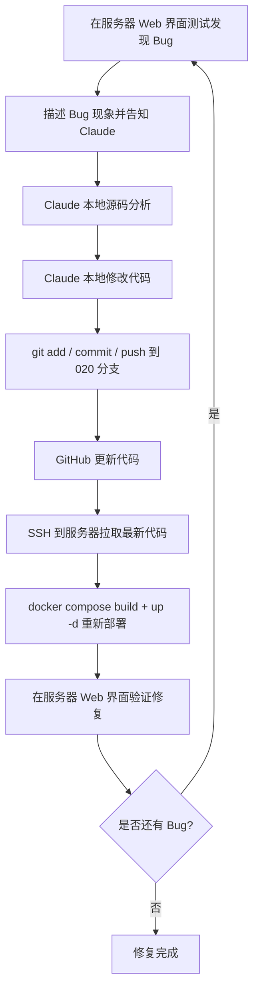

# AI 内容安全模块 Bug 修复方案

## 1. 环境概述

### 1.1 开发环境
- **本地代码仓库**：`C:\Users\iolie\Documents\c-api\c-api`
- **GitHub 仓库**：https://github.com/Channing-xiao/c-api
- **当前开发分支**：`020-ai-content-security`
- **部署分支**：`020-ai-content-security`

### 1.2 测试服务器
- **服务器地址**：`45.251.106.61`
- **Web 访问地址**：http://45.251.106.61:3000
- **登录账号**：`admin`
- **登录密码**：`%XSui9i81fm1!ZC8`
- **部署方式**：Docker Compose（`docker-compose.yml` + `docker-compose.override.yml`）
- **项目路径**：`/home/ai/c-api`

### 1.3 当前已配置工具
- **Claude Code 用户级 skills**：`~/.claude/skills/` 已安装 speckit 系列 skills
- **Claude Code 用户级模板**：`~/.claude/speckit-template/.specify/` 用于新项目初始化
- **Playwright MCP**：`~/.claude/settings.json` 已启用，支持浏览器自动化测试
- **项目级 `.specify/`**：`C:\Users\iolie\Documents\c-api\c-api\.specify/` 已配置

---

## 2. Bug 修复迭代流程



### 2.1 标准操作命令

#### 本地提交
```powershell
cd C:\Users\iolie\Documents\c-api\c-api
git add .
git commit -m "fix(security): 修复 xxx bug"
git push origin 020-ai-content-security
```

#### 服务器更新脚本
```bash
ssh ai@45.251.106.61 "cd /home/ai/c-api && git pull origin 020-ai-content-security && docker compose down && docker compose up -d --build && docker compose ps"
```

#### 服务器快速查看日志
```bash
ssh ai@45.251.106.61 "cd /home/ai/c-api && docker compose logs -f new-api --tail=50"
```

---

## 3. Bug 列表与修复方案

### Bug 1：Mask 动作未将关键字转换为 `***`

#### 现象
在 http://45.251.106.61:3000/security/rules 中创建/编辑规则时，选择 **Action = Mask**，但实际检测时敏感关键字没有被替换为 `***` 符号，脱敏功能未生效。

#### 影响范围
- 后端：`service/security/detector.go`
- 中间件：`middleware/security.go`
- 前端：`web/default/src/features/security/pages/rule-page.tsx` 及表单组件

#### 根因分析
当前 `detector.go` 中 `maskText` 函数实现为：
```go
func maskText(text string) string {
    if len(text) <= 2 {
        return strings.Repeat("*", len(text))
    }
    return text[:1] + strings.Repeat("*", len(text)-2) + text[len(text)-1:]
}
```
该实现只保留首尾字符，中间替换为 `*`，例如 `password` → `p******d`，不符合用户期望的完整隐藏为 `***`。

**但仅修改 `maskText` 不足以解决 Mask 不生效的问题，中间件替换逻辑存在更根本的缺陷：**

1. **`applyMasking` 排序逻辑错误**：当前只是简单反转 `matches` 数组，但 `allMatches` 来自多个引擎的并发/顺序追加，并不能保证已经按位置排序。如果 matches 乱序，从后往前替换会互相覆盖。
2. **请求/响应体替换的根本缺陷**：
   - `extractContentFromRequest` 把所有 `user` 消息用 `\n` 拼接成一个字符串；
   - `applyMasking` 基于拼接后的字符串计算位置并脱敏；
   - `replaceContentInRequest` 却试图在原始 JSON 里替换整个拼接字符串；
   - 当请求/响应包含多条 message 时，原始 JSON 中并不存在 `"msg1\nmsg2"` 这样的字符串，导致 `strings.Replace` 匹配失败，Mask 完全不生效。
3. **`strings.Replace(..., -1)` 副作用**：会无差别替换 JSON 中所有出现该文本的位置，可能误改其他字段（如 model 名、system prompt 等）。

#### 修复方案
1. **修改 `maskText` 函数**：将命中的关键字完整替换为固定长度 `***`。
   ```go
   func maskText(text string) string {
       return "***"
   }
   ```
2. **修复 `applyMasking` 排序**：显式按 `Position[0]` 降序排序，而不是简单反转数组。
   ```go
   sort.Slice(sortedMatches, func(i, j int) bool {
       return sortedMatches[i].Position[0] > sortedMatches[j].Position[0]
   })
   ```
3. **重构中间件替换逻辑**：
   - 不要在 `extractContentFromRequest/Response` 中把多条消息用 `\n` 拼接；
   - 对每条 message 单独检测、脱敏；
   - 在 JSON 层面按路径精确替换，或至少按每条 `content` 字符串单独替换；
   - 如果替换未命中任何内容，记录警告日志，避免问题被掩盖。
4. **检查 `applyMasking` 的 Position 计算**：确保中文/多字节字符的位置计算正确（当前已使用 rune 转 byte，基本正确）。
5. **前端规则测试弹窗**：确保规则测试界面显示 `ProcessedContent` 字段（当前已实现）。
6. **同步更新单元测试**：`detector_test.go` 中 `TestApplyMasking` 和 `TestMaskText` 的期望值需要从 `1*********0` / `a*c` 更新为 `***`。

#### 验证步骤
1. 在 Web 端创建一条 Keyword 规则，Action 选择 Mask，关键词为 `测试`。
2. 调用聊天接口发送包含 `测试` 的单条内容，验证返回内容中 `测试` 被替换为 `***`。
3. 调用聊天接口发送包含 `测试` 的多条 user message，验证所有命中位置都被替换为 `***`。
4. 查看安全日志，确认 `processed_content` 字段包含 `***`。

---

### Bug 2：表单/列表显示英文标签而非本地化文字（原描述为“显示数字”）

#### 现象
在 `/security` 的下级页面（规则、策略、分组等表单及列表）中，Type、Action、Scope、Status、Risk Level 等字段显示的是英文硬编码标签（如 `Keyword`、`Block`、`Low`），而不是当前语言环境下可读的本地化文字。当界面语言为中文时，体验不佳。

#### 影响范围
- 前端表单组件：
  - `web/default/src/features/security/components/rule-form-modal.tsx`
  - `web/default/src/features/security/components/policy-form-modal.tsx`
  - `web/default/src/features/security/components/group-form-modal.tsx`
- 前端列表页：
  - `web/default/src/features/security/pages/rule-page.tsx`
  - `web/default/src/features/security/pages/policy-page.tsx`
  - `web/default/src/features/security/pages/group-page.tsx`
  - `web/default/src/features/security/pages/log-page.tsx`
- i18n：`web/default/src/i18n/locales/en.json` / `zh.json` 等

#### 根因分析
经检查代码，当前表单 Select 和列表页**已经做了数字到 label 的映射**，并不是直接显示数字。真正的问题是：

1. **Label 没有走 i18n**：所有映射都写死了英文，例如 `'Keyword'`、`'Pass'`、`'Block'`、`'Low'`，没有使用 `t('...')` 包裹。
2. **常量前后端不同步**：后端 `constant/security.go` 使用 `iota + 1` 定义枚举，前端却在多个文件里重复手写数字映射（`ruleTypeMap`、`actionMap`、`scopeMap`、`riskLevelMap`）。后端枚举值一旦调整，前端容易遗漏。
3. **`SelectValue` fallback 不完善**：当 `form.type` 等值不在 options 中时，可能回退显示原始数字。

#### 修复方案
1. **抽取统一常量文件**：在前端创建 `web/default/src/features/security/constants.ts`，集中定义：
   ```typescript
   export const RULE_TYPES = [
     { value: 1, labelKey: 'Keyword Match' },
     { value: 2, labelKey: 'Regex Match' },
     { value: 3, labelKey: 'NER' },
     { value: 4, labelKey: 'AI Detection' },
   ]

   export const ACTIONS = [
     { value: 1, labelKey: 'Pass' },
     { value: 2, labelKey: 'Alert' },
     { value: 3, labelKey: 'Mask' },
     { value: 4, labelKey: 'Block' },
     { value: 5, labelKey: 'Review' },
   ]

   export const SCOPES = [
     { value: 1, labelKey: 'Request Only' },
     { value: 2, labelKey: 'Response Only' },
     { value: 3, labelKey: 'Both' },
   ]

   export const STATUSES = [
     { value: 0, labelKey: 'Disabled' },
     { value: 1, labelKey: 'Enabled' },
   ]

   export const RISK_LEVELS = [
     { value: 1, labelKey: 'Low', color: 'bg-green-100 text-green-800' },
     { value: 2, labelKey: 'Medium', color: 'bg-yellow-100 text-yellow-800' },
     { value: 3, labelKey: 'High', color: 'bg-orange-100 text-orange-800' },
     { value: 4, labelKey: 'Critical', color: 'bg-red-100 text-red-800' },
   ]
   ```
2. **所有表单和列表统一使用上述常量**，并用 `t(labelKey)` 进行本地化。
3. **补充 i18n 键值**：在 `en.json`、`zh.json` 等语言文件中添加对应的标签翻译。
4. **为 Select 增加 fallback**：
   ```tsx
   <SelectValue>
     {RULE_TYPES.find((o) => o.value === form.type)?.labelKey
       ? t(RULE_TYPES.find((o) => o.value === form.type)!.labelKey)
       : t('Unknown')}
   </SelectValue>
   ```
5. 后续如后端枚举值变更，只需同步修改 `constants.ts` 一处。

#### 验证步骤
1. 打开 `/security/rules` 页面，点击新建规则。
2. 检查 Type、Action、Status 等下拉框是否显示中文/英文标签（随界面语言切换）。
3. 保存后查看列表页，确认显示的是本地化标签而非数字或英文。
4. 同样验证 `/security/policies` 和 `/security/groups` 表单及列表。
5. 验证 `/security/logs` 的 Action 和 Risk Level 列显示本地化标签。

---

### Bug 3：关键字 Block 后，未匹配内容仍被 Block

#### 现象
当某条 Keyword 规则设置为 Block 并命中一次后，后续发送不包含该关键字的内容，仍然会被拦截并提示 "请求包含敏感内容，已被拦截"。

#### 影响范围
- 后端检测引擎：`service/security/engine_keyword.go`
- 检测主逻辑：`service/security/detector.go`
- 缓存逻辑：`service/security/cache.go`
- 中间件：`middleware/security.go`

#### 根因分析
**当前对该 Bug 的根因尚不明确，必须先通过日志复现定位，不建议直接加防御性代码掩盖问题。** 可能原因包括：

1. **缓存没有 TTL（最可疑）**：
   - `cache.go` 中定义了 `SecurityCacheExpiration = 5 * time.Minute`，但代码里完全没有使用；
   - `securityRuleCache` 和 `securityPolicyCache` 是普通 map，写入后**永不自动过期**；
   - 如果规则被禁用/删除但缓存未失效，后续请求仍可能使用旧规则导致误报；
   - 文档中“等待 5 分钟缓存过期”的说法与实际代码不符。
2. **`detector.go` 未使用策略缓存**：
   - 检测时直接调用 `GetUserPolicies(userID)`，而 `cache.go` 中实现的 `GetCachedUserPolicies` 从未被调用；
   - 这本身不会导致误报，但说明缓存设计不完整。
3. **中间件内容提取缺陷**：
   - 同 Bug 1，`extractContentFromRequest` 对多 message 的拼接方式可能导致检测/替换行为异常，进而表现为“不该拦截的内容被拦截”。
4. **KeywordDetector 本身逻辑**：
   - `matchedRules` 是函数内局部变量，每次调用都会重置；
   - `hits` 为空时会正确返回 `Detected = false`；
   - 目前未发现导致误报的逻辑缺陷。

#### 修复方案
1. **先加日志，复现定位**：
   - 在 `DetectionEngine.Detect` 返回前打印：`userID`、内容摘要、`len(policies)`、`len(rules)`、`len(matches)`、`result.Action`、命中的 `ruleIDs`；
   - 在 `KeywordDetector.Detect` 中打印：`allKeywords` 长度、`hits` 长度、命中的 word、最终 `Detected`；
   - 在 `middleware.SecurityCheck` / `SecurityCheckResponse` 中打印：`content` 摘要、`result.Detected`、`result.Action`。
2. **修复缓存 TTL**：
   - 给 `securityRuleCache` / `securityPolicyCache` 增加写入时间戳，读取时判断是否过期；
   - 或使用 Redis 缓存并设置 TTL；
   - 删除或正确使用 `SecurityCacheExpiration` 常量。
3. **统一策略缓存使用**：
   - 在 `detector.go` 中改为调用 `GetCachedUserPolicies`；
   - 或如果不需要缓存，删除 `GetCachedUserPolicies` 冗余代码。
4. **修复中间件多 message 拼接问题**（同 Bug 1）。
5. **暂时保留的防御性检查**：
   - 在 `resolveAction` 已经处理 `len(matches) == 0` 返回 Pass 的情况下，如果仍出现 Block 但无 match，应在 `Detect` 返回前加断言日志，而不是简单降级。

#### 验证步骤
1. 创建一条 Keyword 规则，关键词为 `敏感词`，Action = Block。
2. 第一次发送包含 `敏感词` 的内容，确认被 block。
3. 第二次发送不包含 `敏感词` 的内容，确认正常返回。
4. 第三次再次发送包含 `敏感词` 的内容，确认仍然被 block。
5. 查看服务器日志，确认每次检测的命中情况、缓存命中情况。

---

## 4. 修复优先级

| 优先级 | Bug | 原因 |
|--------|-----|------|
| P1 | Bug 1 Mask 未生效 | 核心安全功能缺陷，且中间件替换逻辑有根本性问题 |
| P1/P2 | Bug 3 误报 Block | 影响正常使用，但根因不明，需先加日志定位；同时修复缓存无 TTL |
| P2 | Bug 2 标签未本地化 | 表单已显示 label，只是未走 i18n，影响小于核心功能 |

---

## 5. 自动化测试建议

### 5.1 本地单元测试
- `service/security/detector_test.go`：
  - 更新 `TestMaskText`，验证返回 `"***"`；
  - 更新 `TestApplyMasking`，验证中文、多 matches、乱序 matches 场景；
  - 增加 mask、block、无命中场景的端到端检测测试。
- `service/security/engine_keyword_test.go`：
  - 增加连续两次检测场景：第一次命中 Block，第二次未命中应 Pass；
  - 增加多关键词、大小写不敏感匹配测试。
- `middleware/security_test.go`（如存在，建议新建）：
  - 单条 message 请求 mask 后能正确替换；
  - 多条 message 请求 mask 后能正确替换所有命中位置；
  - Block 请求返回 403；
  - 响应 mask/block 能正确改写响应体。

### 5.2 服务器端到端测试
使用 Playwright MCP 或 curl 脚本：
```bash
# 1. 登录获取 token
# 2. 调用 /api/security/rules 创建规则
# 3. 调用 /v1/chat/completions 测试 block/mask/pass
# 4. 验证响应内容
```

### 5.3 快速验证命令
```bash
# 测试 mask（单条消息）
curl -X POST http://45.251.106.61:3000/v1/chat/completions \
  -H "Authorization: Bearer $TOKEN" \
  -H "Content-Type: application/json" \
  -d '{"model":"gpt-3.5-turbo","messages":[{"role":"user","content":"这是一个测试"}]}'

# 测试 mask（多条消息）
curl -X POST http://45.251.106.61:3000/v1/chat/completions \
  -H "Authorization: Bearer $TOKEN" \
  -H "Content-Type: application/json" \
  -d '{"model":"gpt-3.5-turbo","messages":[{"role":"user","content":"你好"},{"role":"user","content":"这是一个测试"}]}'
```

---

## 6. 回滚策略

如果修复导致更严重问题，可以快速回滚到上一个稳定版本。推荐**使用 `git revert` 产生反向提交**，避免 force push 影响协作：

```bash
# 本地生成 revert 提交
git revert HEAD

# 推送到远程
git push origin 020-ai-content-security

# 服务器重新部署
ssh ai@45.251.106.61 "cd /home/ai/c-api && git pull && docker compose up -d --build"
```

> 注意：如果确实需要强制回退到某个特定提交，再考虑 `git reset --hard <commit>` + `git push --force`，但需提前通知所有协作者。

---

## 7. 沟通模板

每次发现新 Bug 时，请按以下格式描述：

```text
Bug 编号：BUG-XXX
页面 URL：http://45.251.106.61:3000/security/xxx
操作步骤：
1. xxx
2. xxx
3. xxx

预期结果：xxx
实际结果：xxx

是否可复现：是 / 否
相关规则/策略配置：xxx
服务器日志关键片段：xxx
```

---

## 8. 注意事项

1. **服务器密码安全**：`%XSui9i81fm1!ZC8` 仅用于测试环境，不要提交到代码仓库或公开渠道。建议将该密码从本 Markdown 文档中移除，改为引用本地 `.env` 或环境变量，并考虑轮换密码。
2. **Docker 构建时间**：每次重新构建约 5-10 分钟，主要耗时在前端 bun build 和后端 go build。
3. **缓存影响**：当前缓存为普通 map，**没有真正的 5 分钟过期机制**，修改规则/策略后依赖 CRUD 主动失效缓存。如仍出现旧规则生效，请检查 `InvalidateRuleCache`/`InvalidatePolicyCache` 是否被调用，或临时重启容器。
4. **日志位置**：服务器 `/home/ai/c-api/logs/` 或 `docker compose logs new-api`。
5. **分支保护**：`020-ai-content-security` 是个人分支，可以直接 push，无需 PR。

---

*方案创建时间：2026-06-12*  
*适用分支：020-ai-content-security*  
*最近更新：2026-06-12（整合代码审查与根因分析更新）*
